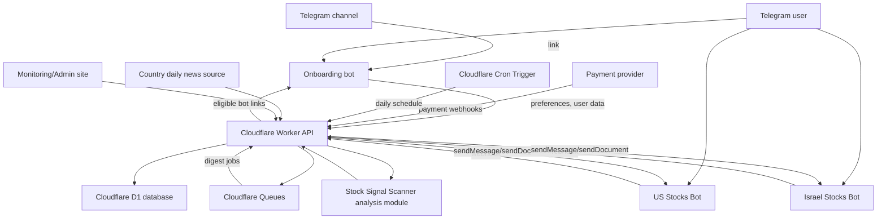
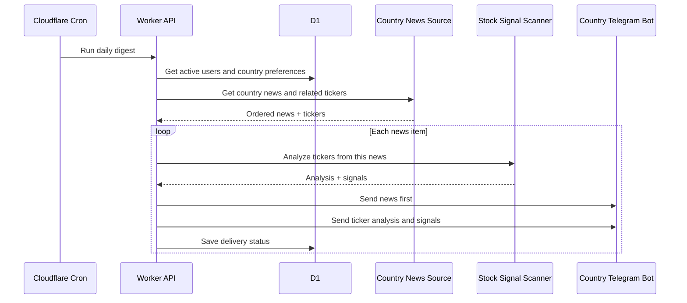
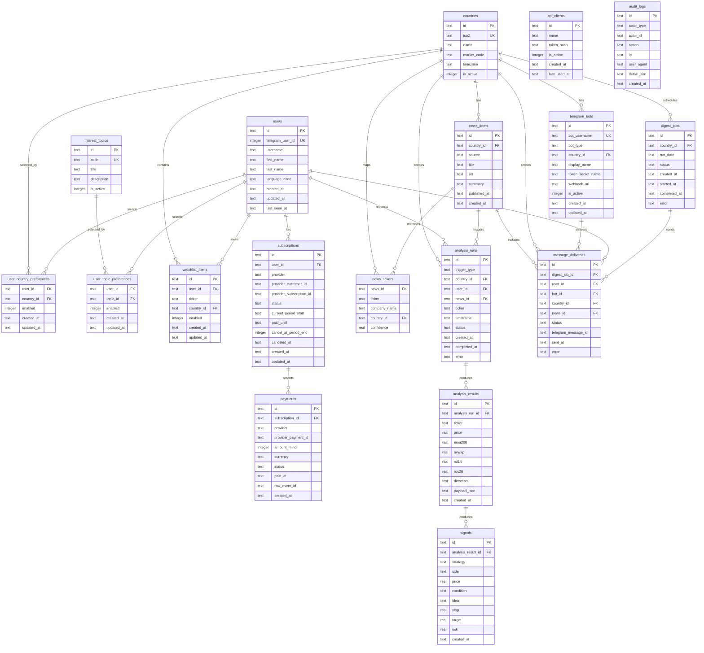

# Stock Signal Scanner: v1 architecture

## Vision

Stock Signal Scanner is the cloud backend for a Telegram-based stock news and signal product.

User journey:

1. User discovers the product through a Telegram channel.
2. User opens the onboarding bot.
3. The bot asks what countries and market/news topics interest the user.
4. Backend creates or updates the user account and stores preferences.
5. If the user has an active subscription, backend gives links to country-specific bots.
6. Country bots send daily digests: news, related tickers, analysis, signals.
7. User can manually send tickers and receive analysis while subscription is active.

Decision: country bots are created manually through BotFather. Their tokens are stored as Cloudflare secrets or encrypted backend values. The backend manages them through Telegram Bot API webhooks.

## V1 Scope

Countries:

- Israel
- United States

Included:

- Onboarding bot.
- Country-specific bots: US Stocks Bot, Israel Stocks Bot.
- Country and topic preferences.
- User watchlists.
- Subscription status and paid-until logic.
- Daily digest orchestration.
- Manual ticker analysis.
- Logs and monitoring.
- Dev and production environments.

Not included in v1:

- Automatic BotFather bot creation.
- Premium PDF reports.
- Full payment-provider automation until provider is selected.
- Integration with `telegram_company_matcher_app`, because it will work independently for now.

## Watchlist Meaning

Watchlist is a user's personal list of tickers.

Ticker sources:

1. News-linked tickers: tickers related to a country news item.
2. Manual ticker requests: user sends `AAPL` or `AAPL, MSFT` to a bot.
3. Watchlist tickers: user saves tickers they always want monitored.

For v1, watchlist should be stored. It can first be used for manual analysis shortcuts, then later for daily watchlist summaries.

## High-Level System



## Daily Digest Flow



Message order must be strict:

1. News.
2. Tickers from that news.
3. Analysis.
4. Signals.

## Bot Roles

### Onboarding Bot

- Collect user profile.
- Show checklist of countries.
- Show checklist of news/economic interests.
- Store preferences in backend.
- Show country bot links if subscription is active.
- Handle subscription status messages.

### Country Bots

V1 bots:

- Israel Stocks Bot.
- US Stocks Bot.

Responsibilities:

- Send daily country-specific digest.
- Receive manual ticker requests.
- Return analysis if the user has active access to that country.

Access rule:

- `subscriptions.paid_until >= today`.
- User selected the country.
- Country bot is active.

## Subscription Logic

If the user subscribes on July 10:

- `current_period_start = 2026-07-10`
- `paid_until = 2026-08-10`
- access is active through August 10 inclusive.

If the user cancels on July 15:

- `cancel_at_period_end = true`
- `status = canceled`
- `paid_until = 2026-08-10`
- access remains active until August 10 inclusive.

Access check:

```text
is_active = paid_until >= current_date AND status IN ('active', 'canceled', 'trialing', 'past_due_grace')
```

## Payment Provider Options

Provider is not selected yet.

### Stripe Billing

Pros:

- Strong recurring subscription lifecycle.
- Customer portal for card changes and cancellation.
- Webhooks for renewal, failed payment, cancellation.
- Good reporting and business tooling.

Cons:

- Business/country availability must be checked.
- Fees.
- Checkout is usually outside Telegram.

### Telegram Payments / Stars

Pros:

- Native Telegram user experience.
- Lower friction inside Telegram.
- Useful for Telegram-first products.

Cons:

- Subscription lifecycle and payout rules must be verified carefully.
- Less flexible than Stripe for classic SaaS billing.
- Reporting/tax workflows may be weaker.

### Crypto / USDT

Pros:

- Global availability for some users.
- Useful where cards are hard.

Cons:

- More compliance and accounting complexity.
- Harder monthly renewal UX.
- Higher operational/security risk.

Initial recommendation:

- Prefer Stripe Billing if available for the business jurisdiction.
- Keep Telegram-native payments as a later option.
- Avoid custom crypto billing in v1 unless there is a clear business reason.

## Dev And Production

Preferred approach: one GitHub repository with two Cloudflare Worker environments.

Environments:

- `dev`: test bots, test D1, test secrets, test domain.
- `production`: real bots, real D1, real secrets, production domain.

Pros:

- Same codebase.
- Safer releases.
- Production data is protected from tests.
- Clear deployment path: dev first, production after validation.

Cons:

- Wrangler config is more complex.
- Every secret and binding must be configured twice.

Alternative: two separate Cloudflare projects.

Pros:

- Strong isolation.
- Easier mental model.

Cons:

- More duplication.
- Higher risk of config drift.

Recommendation:

- Use one repo with Wrangler environments.
- Use separate D1 databases and separate Telegram bots for dev/prod.
- Later add GitHub Actions with manual approval for production deploy.

## ERD



## Core API Draft

Telegram webhooks:

```text
POST /telegram/:botId/webhook
```

Onboarding:

```text
GET /api/countries
GET /api/topics
POST /api/users/:telegramUserId/preferences
GET /api/users/:telegramUserId/access
```

Manual analysis:

```text
POST /api/analyze
```

Body:

```json
{
  "telegram_user_id": 123,
  "bot_id": "us-stocks-bot",
  "tickers": "AAPL, MSFT"
}
```

Daily digest:

```text
POST /api/internal/digest/run
```

Only callable by cron/internal token.

## Security Requirements

- Bot tokens stored only as Cloudflare secrets or encrypted backend values.
- Telegram webhook endpoints should use Telegram `secret_token` or secret path.
- External API clients use hashed tokens in DB.
- Rate-limit manual ticker requests per user.
- Validate ticker symbols and country access.
- Check subscription on every protected action.
- Separate dev/prod secrets and D1 databases.
- Never log raw payment tokens, bot tokens, or API secrets.
- Store payment webhook events idempotently by provider event id.
- Add audit logs for subscription and preference changes.
- Use least-privilege admin access.

## Open Questions

1. Payment provider: Stripe, Telegram Payments, crypto, or hybrid?
2. Exact names/usernames for onboarding bot, US bot, and Israel bot.
3. Final onboarding checklist topics.
4. Whether free users get delayed news or no country bot access.
5. Daily digest time per country.
6. Whether watchlist tickers appear in daily digest v1 or only manual analysis.

